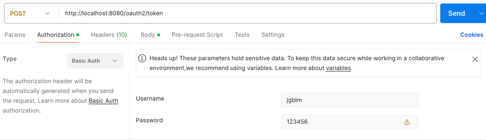
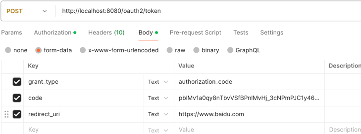
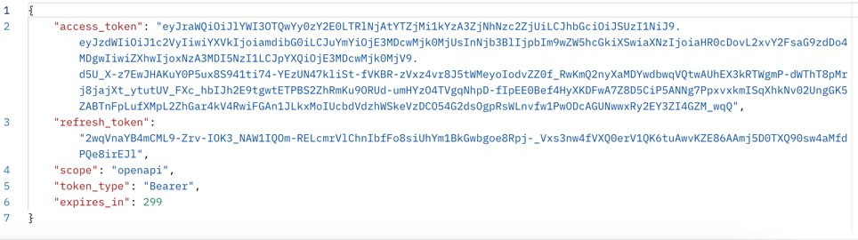

### 1. 构造请求获取资源服务器的授权
http://localhost:8080/oauth2/authorize?response_type=code&client_id=jgblm&scope=openapi&state=12345&redirect_uri=https://www.baidu.com
### 2. 用户登录
使用用户`user`和密码`password`登录，选中openapi，Submit Consent。
### 3. 跳转到redirect_uri，请求地址中携带code。
示例：https://www.baidu.com/?code=pblMv1a0qy8nTbvVSfBPnlMvHj
### 4. 获取token
请求参数  

  
请求结果  
